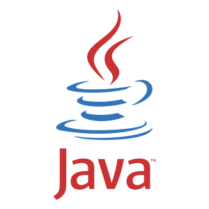

<h1 align="center">Learn Java</h1>

     
    
     

 

    
    
    
    

## About

Overview of the Java programming language with resources from [Oracle](https://dev.java/learn/)'s learning platform.

## Documentation

- [Learn Java (Oracle)](https://dev.java/learn/)
- [JDK 21 Documentation (Oracle)](https://docs.oracle.com/en/java/javase/21/)

## Roadmap

### Getting to Know the Language

- [x] [Java Language Basics](https://dev.java/learn/language-basics/)
- [x] [Classes and Objects](https://dev.java/learn/classes-objects/)
- [x] [Using Record to Model Immutable Data](https://dev.java/learn/records/)
- [x] [Numbers and Strings](https://dev.java/learn/numbers-strings/)
- [ ] [Inheritance](https://dev.java/learn/inheritance/)
- [ ] [Interfaces](https://dev.java/learn/interfaces/)
- [ ] [Generics](https://dev.java/learn/generics/)
- [ ] [Lambda Expressions](https://dev.java/learn/lambdas/)
- [ ] [Annotations](https://dev.java/learn/annotations/)
- [x] [Packages](https://dev.java/learn/packages/)
- [ ] [Exceptions](https://dev.java/learn/exceptions/)
- [ ] [Refactoring from the Imperative to the Functional Style](https://dev.java/learn/refactoring-to-functional-style/)

### Mastering the API

- [ ] [The Java I/O API](https://dev.java/learn/java-io/)
- [ ] [Common I/O Tasks in Modern Java](https://dev.java/learn/modernio/)
- [ ] [The Date Time API](https://dev.java/learn/date-time/)
- [ ] [Regular Expressions](https://dev.java/learn/regex/)
- [ ] [Fundamentals of Security using JDK Libraries](https://dev.java/learn/security/)

## License

This project is released under the [MIT License](./LICENSE.md).
